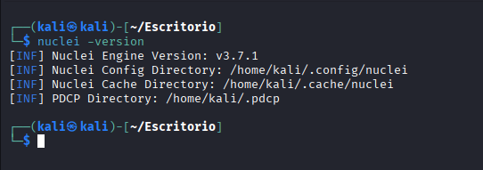
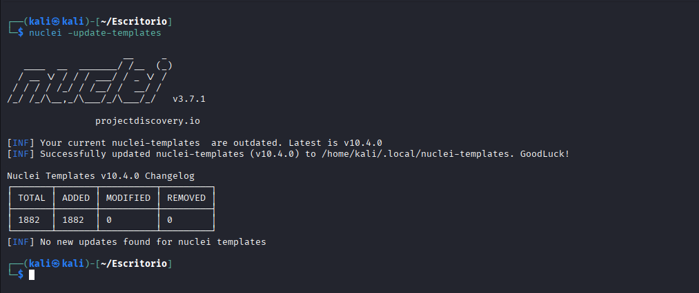
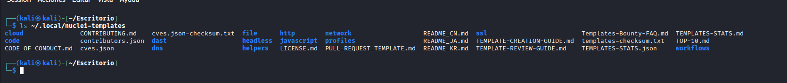
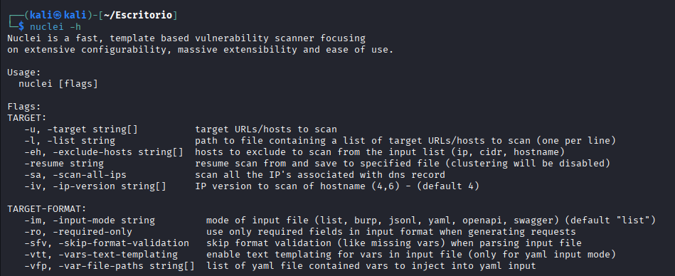

# Instalación de Nuclei

Antes de comenzar a utilizar Nuclei es necesario instalar la herramienta y descargar su repositorio de templates.  
En esta sección se describen los métodos más comunes para instalar Nuclei en entornos de análisis de seguridad.

En el contexto de laboratorios de ciberseguridad y pentesting, la herramienta suele utilizarse en distribuciones como **Kali Linux**, donde su instalación es muy sencilla.

---

# Instalación en Kali Linux

La forma más rápida de instalar Nuclei en Kali Linux es mediante el gestor de paquetes **APT**.

```bash
sudo apt update
sudo apt install nuclei
```


Una vez finalizada la instalación, podemos verificar que la herramienta está correctamente instalada ejecutando:

```bash
nuclei -version
```


Si la instalación se ha realizado correctamente, el sistema mostrará la versión instalada de Nuclei.

Actualización de templates

Los templates son el componente principal de Nuclei, ya que contienen las reglas que permiten detectar vulnerabilidades.

Después de instalar la herramienta, es recomendable actualizar el repositorio de templates ejecutando:

```bash
nuclei -update-templates
```



Esto descargará la última versión de los templates mantenidos por la comunidad.


Ubicación de los templates

Por defecto, Nuclei almacena los templates en el siguiente directorio:

```
~/.nuclei-templates/
```



En este directorio se encuentran organizadas diferentes categorías de detección, como por ejemplo:

CVEs

exposiciones

errores de configuración

tecnologías detectadas

paneles administrativos

Estos templates pueden utilizarse directamente o modificarse según las necesidades del analista.


Instalación alternativa mediante Go

Otra forma de instalar Nuclei es utilizando Go, descargando directamente el código desde el repositorio oficial.

Este método suele utilizarse cuando se desea disponer de la última versión de desarrollo.

```
go install -v github.com/projectdiscovery/nuclei/v3/cmd/nuclei@latest
```

Tras la instalación, es recomendable añadir el directorio de binarios de Go al PATH del sistema para poder ejecutar la herramienta desde cualquier ubicación.


Comprobación de la instalación

Para comprobar que Nuclei funciona correctamente podemos ejecutar un comando simple:

```bash
nuclei -h
```



Esto mostrará la ayuda de la herramienta y confirmará que el binario está correctamente instalado en el sistema.


Conclusión

Una vez instalado Nuclei y actualizados los templates, el entorno está preparado para comenzar a realizar escaneos de vulnerabilidades.

En la siguiente sección se explicará el uso básico de la herramienta, mostrando los primeros comandos necesarios para ejecutar análisis sobre objetivos concretos.
