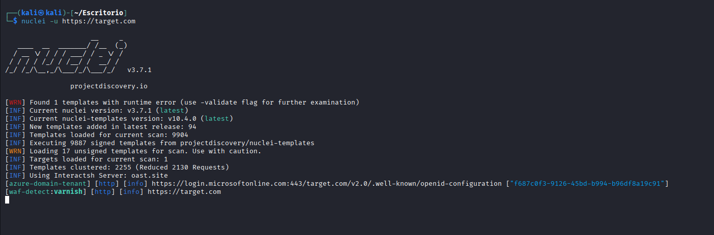
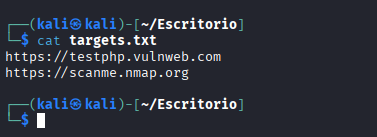
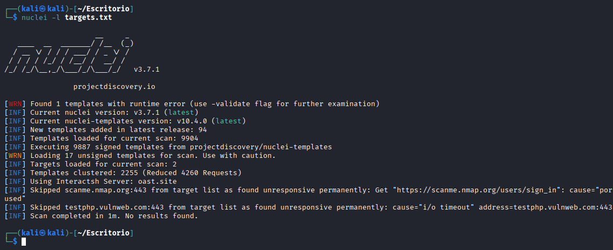
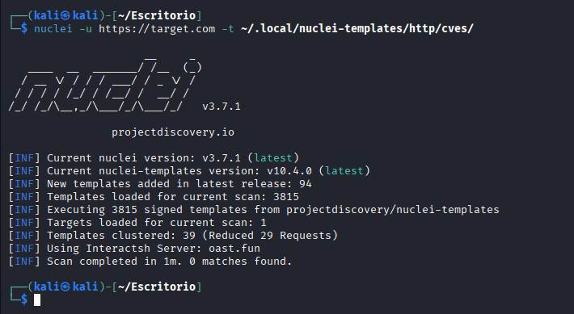
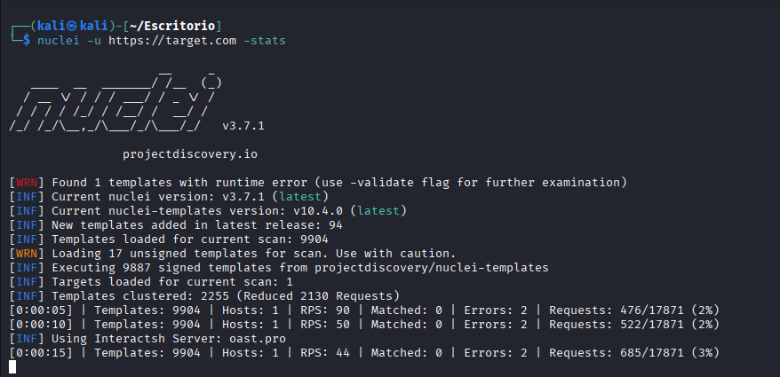

# Uso básico de Nuclei

Una vez instalada la herramienta y actualizados los templates, el siguiente paso es aprender a ejecutar escaneos básicos utilizando Nuclei.

Esta sección presenta los comandos más utilizados por analistas para realizar análisis iniciales de vulnerabilidades sobre uno o varios objetivos.

---

# Escaneo de un objetivo individual

La forma más sencilla de utilizar Nuclei es analizar una única URL.

```bash
nuclei -u https://target.com
```


En este caso:

-u indica la URL objetivo.

Nuclei ejecutará automáticamente los templates disponibles sobre ese objetivo.

Durante el escaneo, la herramienta analizará el servicio y mostrará posibles hallazgos relacionados con vulnerabilidades conocidas, configuraciones inseguras o exposición de información.

Escaneo de múltiples objetivos

En escenarios reales de pentesting o bug bounty es habitual trabajar con múltiples objetivos.
Para ello, Nuclei permite cargar una lista de hosts desde un archivo.

Por ejemplo, si tenemos un archivo llamado targets.txt:



Podemos ejecutar el escaneo de la siguiente forma:

```
nuclei -l targets.txt
```

Donde:

-l indica que el escaneo se realizará sobre una lista de objetivos.

Este método es especialmente útil cuando los objetivos han sido obtenidos previamente mediante herramientas de reconocimiento.



Uso de templates específicos

Nuclei permite ejecutar únicamente un conjunto específico de templates.

Por ejemplo, si queremos analizar únicamente vulnerabilidades asociadas a CVEs:

```
nuclei -u https://target.com -t ~/.local/nuclei-templates/http/cves/
```

En este caso:

-t indica la carpeta de templates que se desea utilizar.

Esto permite al analista enfocar el escaneo en un tipo concreto de vulnerabilidades.




Filtrado por nivel de severidad

Otra funcionalidad muy útil es la posibilidad de ejecutar templates según su nivel de severidad.

Por ejemplo, para analizar únicamente vulnerabilidades críticas:

```
nuclei -u https://target.com -severity critical
```

También es posible combinar distintos niveles de severidad:

```
nuclei -u https://target.com -severity medium,high,critical

```

Esto permite priorizar vulnerabilidades más relevantes durante un análisis.


Mostrar estadísticas del escaneo

Durante la ejecución de un escaneo, Nuclei puede mostrar estadísticas en tiempo real.

```
nuclei -u https://target.com -stats

```


Estas estadísticas incluyen información sobre:

  número de templates ejecutados

  número de peticiones realizadas

  progreso del escaneo

Este modo resulta útil para monitorizar análisis más largos.

Ejemplo de escaneo completo

Un ejemplo sencillo combinando varias opciones sería:

```
nuclei -l targets.txt -severity medium,high,critical -stats
```

Este comando:

analiza múltiples objetivos

busca vulnerabilidades relevantes

muestra estadísticas del progreso del escaneo.
