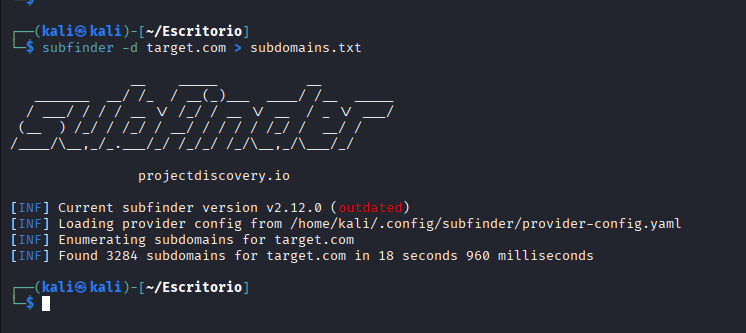
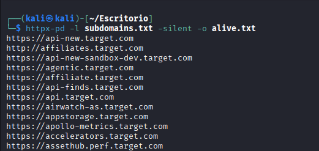
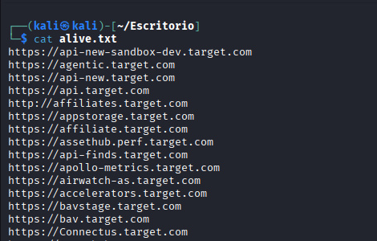
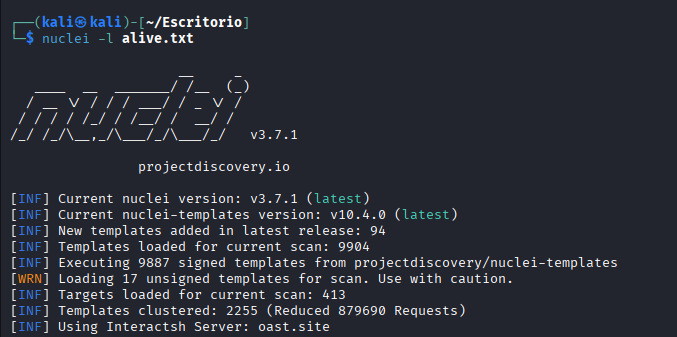

# Workflows profesionales con Nuclei

En entornos reales de pentesting o análisis de vulnerabilidades, Nuclei rara vez se utiliza de forma aislada.  
Lo más habitual es integrarlo dentro de un **flujo de reconocimiento automatizado**, donde diferentes herramientas se encargan de descubrir activos, identificar servicios activos y finalmente analizar posibles vulnerabilidades.

Este tipo de enfoque permite analizar grandes superficies de ataque de forma eficiente.

---

# Flujo típico de reconocimiento

Un flujo de trabajo muy utilizado dentro de la comunidad de seguridad es el siguiente:

Subfinder → Httpx → Nuclei

Cada herramienta cumple una función específica dentro del proceso de análisis.

---

# 1. Descubrimiento de subdominios

El primer paso consiste en descubrir subdominios asociados al dominio objetivo.  
Para ello se puede utilizar **Subfinder**, una herramienta de reconocimiento pasivo muy utilizada en bug bounty y pentesting.

Ejemplo:

```bash
subfinder -d target.com > subdomains.txt
```



Este comando obtiene subdominios asociados al dominio objetivo y guarda los resultados en un archivo.

2. Identificación de hosts activos

Una vez obtenidos los subdominios, el siguiente paso es identificar cuáles están activos y responden a peticiones HTTP o HTTPS.

Para ello se utiliza Httpx, otra herramienta desarrollada por ProjectDiscovery.

```bash
httpx-pd -l subdomains.txt -silent -o alive.txt
```



Esto permite filtrar únicamente los hosts que están activos y pueden ser analizados posteriormente.

Si analizamos el archivo vemos los resultados




3. Escaneo de vulnerabilidades con Nuclei

Finalmente, los hosts activos se analizan utilizando Nuclei.

```bash
nuclei -l alive.txt
```



En este punto Nuclei ejecutará los templates disponibles sobre cada uno de los hosts detectados.

Ventajas de este enfoque

Utilizar Nuclei dentro de un flujo automatizado aporta múltiples ventajas:

Automatización del reconocimiento

Permite analizar grandes cantidades de activos sin necesidad de intervención manual.

Mayor cobertura

Se analizan únicamente los hosts activos, reduciendo ruido y mejorando la eficiencia.

Integración sencilla

Las herramientas utilizadas comparten formatos compatibles, lo que facilita la creación de pipelines.

Escalabilidad

Este tipo de flujo puede utilizarse tanto en auditorías pequeñas como en análisis de grandes infraestructuras.

Consideraciones importantes

Aunque herramientas como Nuclei automatizan gran parte del análisis, es importante recordar que:

No todos los hallazgos representan vulnerabilidades reales.

Algunos resultados pueden requerir verificación manual.

Los escaneos deben realizarse únicamente sobre sistemas para los que se tenga autorización.

Conclusión

Integrar Nuclei dentro de un flujo de reconocimiento permite optimizar significativamente el proceso de análisis de vulnerabilidades.

Al combinar herramientas especializadas para cada fase del reconocimiento, los analistas pueden centrarse en interpretar los resultados y validar posibles vulnerabilidades en lugar de realizar tareas repetitivas.

