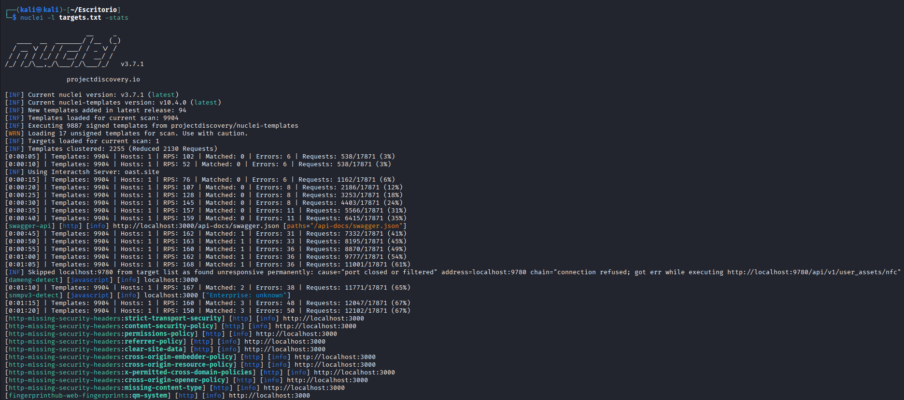
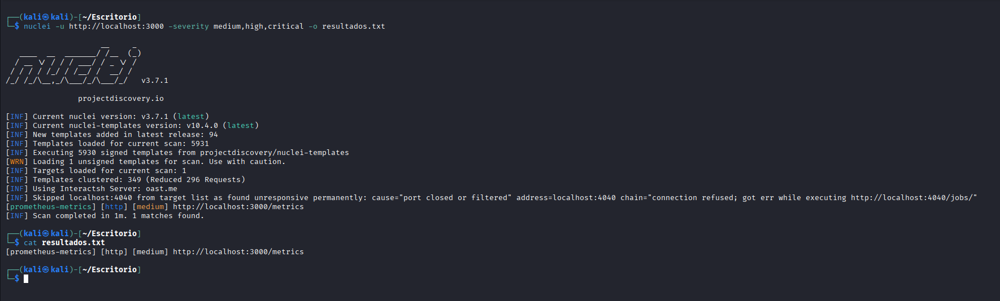

# Laboratorio práctico: Escaneo de una aplicación vulnerable con Nuclei

En este laboratorio se muestra un ejemplo práctico de cómo utilizar **Nuclei** para analizar una aplicación web vulnerable desplegada en un entorno local mediante **Docker**.

El objetivo es demostrar cómo un analista de seguridad puede utilizar Nuclei para identificar posibles vulnerabilidades en aplicaciones web dentro de un **entorno controlado y seguro**, sin comprometer sistemas reales.

> ⚠️ **Aviso legal:** Este laboratorio está diseñado exclusivamente para fines educativos. Nunca debes ejecutar escaneos con Nuclei sobre sistemas que no sean de tu propiedad o para los que no tengas autorización expresa.

---

## Objetivo del laboratorio

Al finalizar este laboratorio serás capaz de:

- Desplegar una aplicación web vulnerable en un entorno local con Docker
- Configurar y ejecutar un escaneo completo con Nuclei
- Filtrar resultados por nivel de severidad
- Interpretar y analizar los hallazgos detectados

Para ello utilizaremos **OWASP Juice Shop**, una de las aplicaciones vulnerables más utilizadas en el mundo de la formación en seguridad web. Fue creada por OWASP y contiene deliberadamente decenas de vulnerabilidades reales del tipo que se encuentran en aplicaciones de producción: inyección SQL, XSS, broken authentication, exposición de datos sensibles, entre otras.

---

## Requisitos

Antes de comenzar, asegúrate de tener lo siguiente instalado y funcionando:

| Requisito | Descripción |
|-----------|-------------|
| **Sistema operativo** | Kali Linux u otra distribución Linux |
| **Docker** | Motor de contenedores para desplegar la aplicación |
| **Nuclei** | Herramienta de escaneo de vulnerabilidades |
| **Conexión a Internet** | Necesaria para descargar la imagen de Docker y actualizar los templates de Nuclei |

Si no tienes Nuclei instalado, puedes instalarlo con:

```bash
go install -v github.com/projectdiscovery/nuclei/v3/cmd/nuclei@latest
```

O directamente descargando el binario desde la [página oficial de ProjectDiscovery](https://github.com/projectdiscovery/nuclei/releases).

---

## Paso 1 — Despliegue de la aplicación vulnerable

### Descarga de la imagen de OWASP Juice Shop

El primer paso es descargar la imagen oficial de **OWASP Juice Shop** desde Docker Hub. Esta imagen contiene toda la aplicación preconfigurada y lista para ejecutarse:

```bash
docker pull bkimminich/juice-shop
```

Docker descargará la imagen por capas desde el registro oficial. El proceso puede tardar unos minutos dependiendo de tu conexión.


*Como se observa en la captura, Docker descarga cada capa de la imagen de forma independiente y muestra el progreso en tiempo real. Al finalizar, la imagen queda almacenada localmente y lista para su uso.*

---

### Ejecución del contenedor

Una vez descargada la imagen, lanzamos el contenedor con el siguiente comando:

```bash
docker run -d -p 3000:3000 bkimminich/juice-shop
```

Este comando hace lo siguiente:

- **`-d`** — Ejecuta el contenedor en segundo plano (*detached mode*), de forma que no bloquea la terminal y podemos seguir trabajando.
- **`-p 3000:3000`** — Mapea el puerto 3000 del contenedor al puerto 3000 de tu máquina local. El formato es `puerto_host:puerto_contenedor`.
- **`bkimminich/juice-shop`** — Es el nombre de la imagen que acabamos de descargar.


*Docker devuelve el ID completo del contenedor recién creado (una cadena hexadecimal larga). Esto indica que el contenedor se ha iniciado correctamente en segundo plano.*

---

### Verificación del contenedor

Para confirmar que el contenedor está en ejecución, usamos:

```bash
docker ps
```

Este comando lista todos los contenedores activos en el sistema. Deberías ver una entrada con la imagen `bkimminich/juice-shop` y el estado `Up`.

Si todo ha ido bien, la aplicación ya está disponible en:

```
http://localhost:3000
```

Abre el navegador y accede a esa dirección para confirmar que Juice Shop carga correctamente:


*La pantalla de inicio de OWASP Juice Shop confirma que la aplicación está desplegada y accesible. A partir de aquí ya tenemos un objetivo válido sobre el que ejecutar el escaneo.*

---

## Paso 2 — Preparación del objetivo para Nuclei

Nuclei permite especificar los objetivos de dos formas: directamente por URL con el flag `-u`, o a través de un archivo de texto con el flag `-l`. Usar un archivo es especialmente útil cuando quieres escanear múltiples objetivos o cuando deseas mantener un registro ordenado de los blancos del análisis.

Creamos el archivo `targets.txt` con el editor `nano`:

```bash
nano targets.txt
```

Dentro del archivo escribimos la URL de nuestra aplicación:

```
http://localhost:3000
```

Guardamos con `Ctrl + O` y salimos con `Ctrl + X`.


*El archivo `targets.txt` contiene únicamente la URL del objetivo. Nuclei leerá este archivo línea a línea, por lo que podríamos añadir más URLs si quisiéramos analizar varios objetivos en un solo escaneo.*

---

## Paso 3 — Ejecución del escaneo con Nuclei

### Escaneo completo con estadísticas

Con el objetivo definido, ya podemos lanzar el escaneo. El siguiente comando ejecuta Nuclei contra todos los templates disponibles y muestra estadísticas en tiempo real:

```bash
nuclei -l targets.txt -stats
```

- **`-l targets.txt`** — Indica a Nuclei que lea los objetivos desde el archivo que creamos.
- **`-stats`** — Activa la visualización de estadísticas en tiempo real: número de templates ejecutados, peticiones enviadas, hallazgos encontrados, etc.

Nuclei cargará automáticamente todos los templates de su biblioteca local (que puede contener miles de comprobaciones) y los ejecutará secuencialmente contra el objetivo. El proceso puede durar varios minutos.



*Durante el escaneo, Nuclei muestra en pantalla cada hallazgo detectado en tiempo real, indicando el nombre del template que lo identificó, la severidad (info, low, medium, high, critical) y la URL afectada. Al finalizar, muestra un resumen total del análisis con el número de templates ejecutados y hallazgos encontrados.*

---

### Escaneo filtrado por severidad y exportación de resultados

En la mayoría de los casos no querremos analizar todos los resultados a la vez. Nuclei permite filtrar por nivel de severidad para centrarse en lo más relevante. El siguiente comando escanea únicamente en busca de vulnerabilidades de severidad **media, alta o crítica**, y guarda los resultados en un archivo:

```bash
nuclei -u http://localhost:3000 -severity medium,high,critical -o resultados.txt
```

- **`-u http://localhost:3000`** — Especifica el objetivo directamente por URL, sin necesidad de archivo.
- **`-severity medium,high,critical`** — Filtra los templates para que solo se ejecuten los que detectan vulnerabilidades de esas severidades, reduciendo el ruido y el tiempo de escaneo.
- **`-o resultados.txt`** — Guarda todos los hallazgos en el archivo `resultados.txt` para poder revisarlos con calma posteriormente.



*En esta captura se observa cómo Nuclei muestra únicamente los hallazgos de severidad media, alta y crítica, descartando el resto. Cada línea incluye el protocolo, la severidad en color, el nombre de la vulnerabilidad detectada y la URL exacta donde fue encontrada. Al mismo tiempo, todos estos resultados se están guardando automáticamente en `resultados.txt`.*

---

## Análisis de los resultados

Una vez finalizado el escaneo, puedes revisar el archivo de resultados con:

```bash
cat resultados.txt
```

O con un paginador para mayor comodidad:

```bash
less resultados.txt
```

Cada línea del archivo sigue este formato:

```
[timestamp] [template-id:nombre] [severidad] URL
```

Algunos de los hallazgos típicos que Nuclei puede detectar en Juice Shop incluyen:

- Cabeceras de seguridad HTTP ausentes o mal configuradas
- Exposición de información sensible en rutas accesibles públicamente
- Configuraciones por defecto inseguras
- Endpoints con autenticación débil o inexistente

> 💡 **Consejo:** Para un análisis más profundo, combina Nuclei con otras herramientas como **Burp Suite** o **OWASP ZAP**. Los resultados de Nuclei son un excelente punto de partida para una auditoría manual más detallada.

---

## Resumen de comandos

| Comando | Descripción |
|---------|-------------|
| `docker pull bkimminich/juice-shop` | Descarga la imagen de Juice Shop |
| `docker run -d -p 3000:3000 bkimminich/juice-shop` | Lanza el contenedor en segundo plano |
| `docker ps` | Verifica que el contenedor está activo |
| `nuclei -l targets.txt -stats` | Escaneo completo con estadísticas en tiempo real |
| `nuclei -u http://localhost:3000 -severity medium,high,critical -o resultados.txt` | Escaneo filtrado por severidad con exportación de resultados |

---

*Laboratorio creado con fines educativos. Todos los escaneos se realizan sobre un entorno local controlado.*
