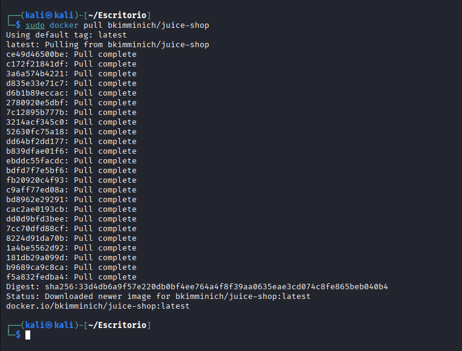
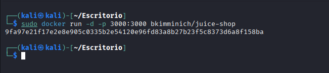
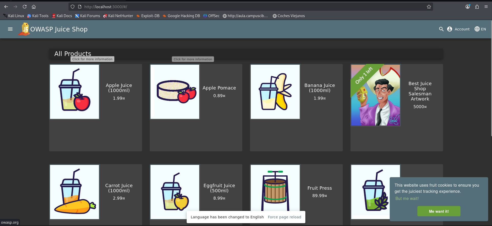
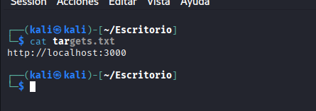

# Laboratorio práctico: Escaneo de una aplicación vulnerable con Nuclei

En este laboratorio se muestra un ejemplo práctico de cómo utilizar **Nuclei** para analizar una aplicación web vulnerable desplegada en un entorno local mediante **Docker**.

El objetivo es demostrar cómo un analista puede utilizar Nuclei para identificar posibles vulnerabilidades en aplicaciones web dentro de un entorno controlado.

---

# Objetivo del laboratorio

El objetivo de este laboratorio es:

- desplegar una aplicación web vulnerable
- ejecutar un escaneo con Nuclei
- analizar los resultados obtenidos

Para ello se utilizará la aplicación **OWASP Juice Shop**, una de las aplicaciones vulnerables más utilizadas para formación en seguridad web.

---

# Requisitos

Antes de comenzar es necesario disponer de:

- Kali Linux u otro sistema Linux
- Docker instalado
- Nuclei instalado
- conexión a Internet

---

# Despliegue de la aplicación vulnerable

Primero descargamos la imagen de **OWASP Juice Shop** desde Docker Hub.

```bash
docker pull bkimminich/juice-shop
```



Una vez descargada la imagen, ejecutamos el contenedor:

```
docker run -d -p 3000:3000 bkimminich/juice-shop
```

Este comando realiza lo siguiente:

-d ejecuta el contenedor en segundo plano

-p 3000:3000 expone el servicio web en el puerto 3000 del sistema




Verificación del contenedor

Podemos comprobar que el contenedor está funcionando correctamente ejecutando:

```
docker ps
```

Si todo funciona correctamente, la aplicación estará disponible en:

http://localhost:3000

Para confirmar que fucniona entramos en la web 



como vemos funciona

Preparación del objetivo para Nuclei

Para ejecutar el escaneo creamos un archivo con el objetivo.


Para ejecutar el escaneo creamos un archivo con el objetivo.

nano targets.txt

Contenido del archivo:

http://localhost:3000

Este archivo será utilizado por Nuclei para identificar el objetivo a analizar.




Ejecución del escaneo

Una vez desplegada la aplicación vulnerable podemos ejecutar Nuclei.

```
nuclei -l targets.txt -stats
```

Este comando ejecuta el escaneo utilizando todos los templates disponibles.


